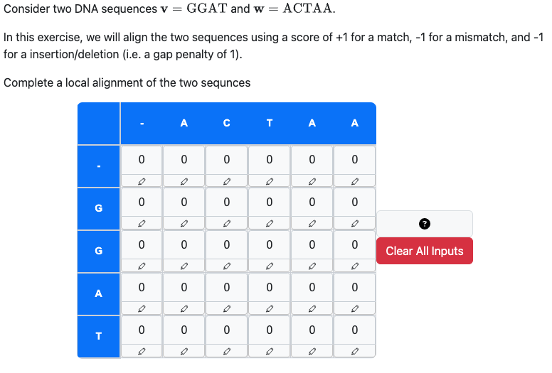

# PrairieLearn OER Element: Sequence Alignment Table

This element was developed by Pai Zheng and Yujie Miao. Please carefully test the element and understand its features and limitations before deploying it in a course. It is provided as-is and not officially maintained by PrairieLearn, so we can only provide limited support for any issues you encounter!

If you like this element, you can use it in your own PrairieLearn course by copying the contents of the `elements` folder (and potentially the `serverFilesCourse`, see below) into your own course repository. After syncing, the element can be used as illustrated by the example question that is also contained in this repository.


## `pl-alignment-table` element

This element creates a dymnamic programming (DP) table for sequence alignment algorithms. It can be used both to display non-interactive instructional materials and interactive, auto-graded questions where students fill in cells and highlight the optimal path.

Note that this element requires a `server.py` script to fill in the table contents or grade answers. Although it is possible to manually generate and grade tables, we recommend using the provided libraries by also copying the scripts from the `serverFilesCourse` folder of this course. See the documentation below and the sample question for details how to configure, randomize and grade this element.

### Example

#### Non-interactive table as question material


```html
    <pl-dp-table answers-name="q1" is-material="true"></pl-dp-table>
```

#### Interactive table where students fill cells and highlight the optimal path



```html
  <pl-dp-table answers-name="q3" type="local"></pl-dp-table>
```

#### Pre-filled table with path highlighting only


```html
  <pl-dp-table answers-name="q2" path-only="true" type="fitting"></pl-dp-table>
```

### Element Attributes
| Attribute | Type | Description |
|-----------|------|-------------|
| `answers-name` | string (required) | Unique identifier for the element |
| `is-material`  | boolean (default: `false`) | If `true`, the table is displayed non-interactively as question material, with all cells already filled. |
| `path-only`    | boolean (default: `false`) | Only relevant if `is-material` is `false`. If `true`, the table is displayed with all cells already filled, asking students to only select the correct path. |
| `type`         | string (default: `global`) | Only relevant if `is-material` is `false`. Alignment type (`global`, `fitting`, or `local`); this affects path constraints checked during grading. |
| `placeholder`  | string (default: ``) | Only relevant if `is-material` is `false`. Placeholder text for unfilled table cells. |
